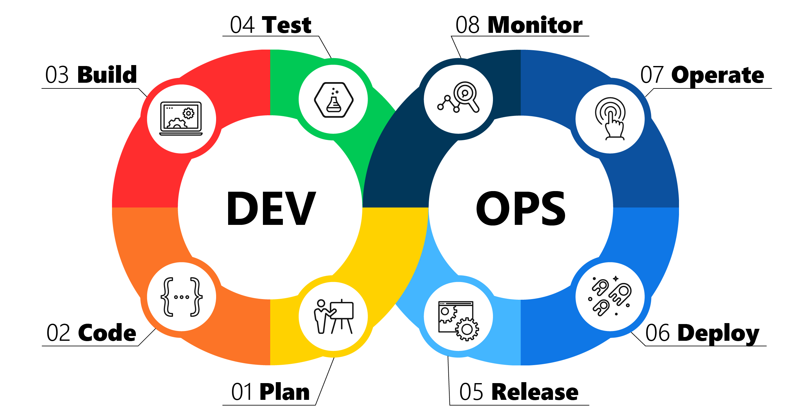
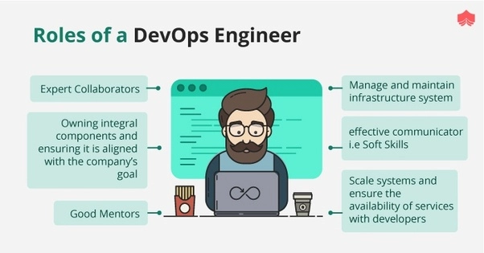

# Devops?

### What is Devops?

DevOps is a set of practices that combines software development ( Dev) and IT operations ( Ops )teams and improves the overall communication. It aims to shorten the systems development life cycle and provide continuous delivery and maintainance with high software quality. DevOps is complementary with Agile software development; several DevOps aspects came from the Agile methodology and implement tthe CI/CD culture so we can shorten the time we can safely deploy our product for clients.

### Why is Devops useful in a business?

Devops culture creates efficient time management for projects that follow the agile way of working. This also leads into the disintergration of silos, as you will have to work together as an intergrated team rather than secluded to your diciplinary group. As i touched on the last section, Devops focuses more on the CI/CD way of working, which allows faster times to deliver solutions, as we have different groups of people working on the same project at the same time.

### What does a Devops engineer do?

A DevOps engineer is responsible for any number of tasks related to:

- Project management
- Writing, editing, and coordinating code and review
- System performance testing and maintenance
- Prototyping features and solutions
- Server administration
- Working with different departments to coordinate design

### Who do DevOps Engineers work with?

A Devops engineer works with many people across the board here are a few:

- Software engineers
- System operators
- Administration
- IT operations
- Product owner / Manager
- Development team
- Stakeholders
- Testers

### What other teams does a DevOps Engineer interact with?

- Front-End Developers
- Back-End Developers
- UI/UX Developers

### What are their common deliverables (what would they be expected to do on day to day basis)?

Funnel - As an idea gets more shape and the business case becomes clearer, the idea drops into the funnel and finally gets picked up to be planned in the road-map.

Roadmap - A roadmap is an approach to describe a realisation path of a product or service.

Release planning - Release planning is the basis for the product backlog. The release plan contains the epics that have to be realised.

Functional decomposition - This concept describes the idea that the realization of a product or service can take place from coarse to fine. In this way, the realisation of ideas in the funnel, roadmap planning, release planning and sprint planning is completed.

As well as all the things described in the What does a Devops engineer do section.

### What is the value of a DevOps Engineer?

A good Devops engineer has knowledge on every part of the CI/CID process and can implement that knowledge when needed. They work cloesly with all the departments that are involved in the project, so that everyone is on the same page. The fact that the Devops engineer has knowledge on all the different working parts means that they can easily communicate with different teams and members for a cohesive working environment.

### How do DevOps Engineers fit into the SDLC?

Because of the CI/CD culture, Devops engineers fall into the entirety of the SDLC, as they moniter, improve, test, deploy and get feedback for each stage! Devops engineers are integral.

### Where can you progress from here?

DevOps Architect: As a DevOps architect, you may be responsible for designing and implementing the overall DevOps strategy for an organization. This involves understanding the business needs, assessing the current infrastructure and processes, identifying opportunities for improvement, and recommending and implementing solutions that align with the organization's goals.

### What is cloud computing?

Cloud computing is a technology that allows users to access and use computing resources such as servers, storage, and applications over the internet. Instead of hosting and managing these resources locally, cloud computing allows users to use them remotely, as a service, provided by a third-party cloud service provider.

### Who uses Devops 

Amazon: Amazon is one of the most prominent examples of a company that has embraced DevOps. The company uses a wide range of DevOps tools and practices to manage its vast cloud infrastructure, which powers services such as Amazon Web Services (AWS). Amazon uses continuous delivery, automated testing, and monitoring to ensure that its services are always available, reliable, and secure.

Netflix: Netflix is another well-known DevOps adopter. The company has built a highly scalable and resilient infrastructure that allows it to stream movies and TV shows to millions of users around the world. Netflix uses a range of DevOps tools and practices, including continuous delivery, automation, and chaos engineering, to ensure that its services are always available and performing at their best.

Etsy: Etsy is an online marketplace that connects buyers and sellers of handmade and vintage items. The company has implemented a DevOps culture that emphasises collaboration, automation, and continuous improvement. Etsy uses tools such as Chef for configuration management, Jenkins for continuous integration and delivery, and Nagios for monitoring and alerting.

Target: Target is a large retail chain that has embraced DevOps to improve its software development and delivery processes. The company has implemented a DevOps culture that encourages collaboration between teams and emphasizes the use of automation and continuous delivery. Target uses tools such as Jenkins for continuous integration and delivery, Puppet for configuration management, and New Relic for monitoring and alerting.

### 4 Pillars of Devops in the cloud
Ease of use – other teams will use our tools, but people wont use them if they’re not user friendly – if the other teams do not use our tools, then there will be problems and delays in the deployment down the line.
Flexibility – it can be easy to get locked in to using a specific software, tool or product as a business. When that’s the case it becomes much harder to keep up with industry changes. – Everything the company uses should be easily changed or updated as the business needs.
Robustness – we need close to 100% up time of our services as possible. – As Devops engineers this is OUR responsibility.
Cost – cost is often overlooked, we need to make sure the company is being as efficient as possible in its tech dealings. – for example how powerful is a machine that we need to run a service or conduct a task, do we need a certain amount of servers running etc.
.png)

